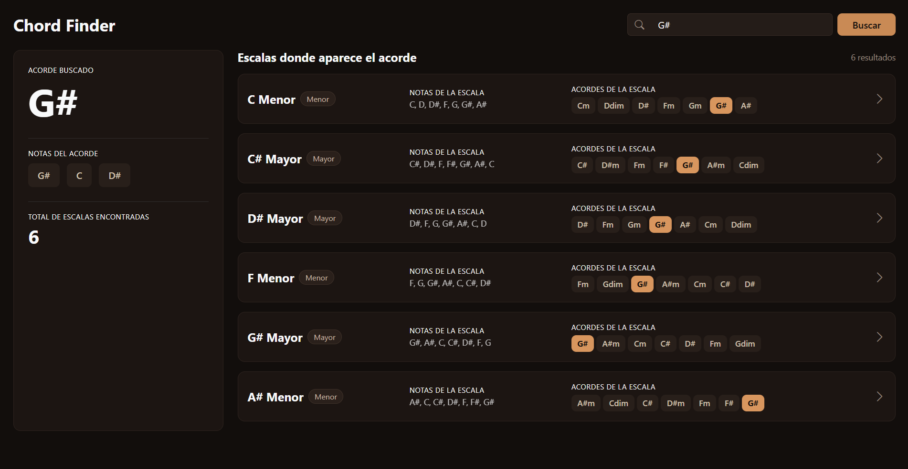
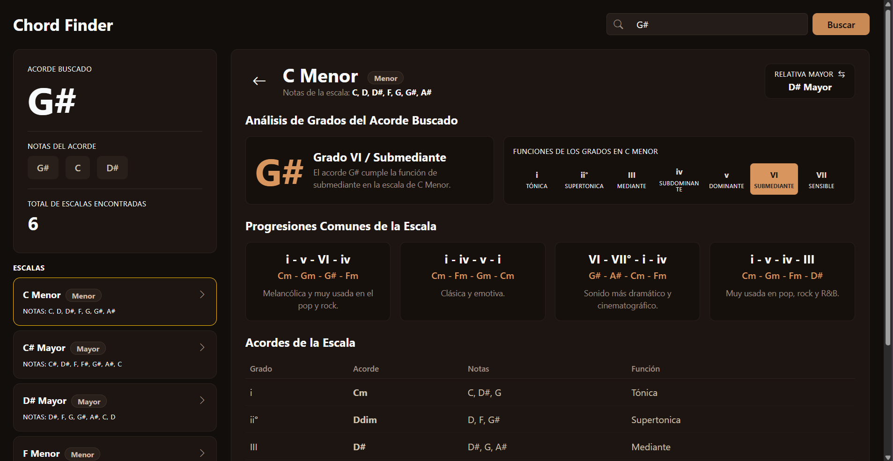

# Chord Finder API & Interactive SPA

**Chord Finder** es una aplicación web interactiva y responsiva diseñada para músicos, compositores y estudiantes de teoría musical. Permite realizar análisis armónicos profundos a partir de un acorde buscado, identificando instantáneamente todas las escalas donde pertenece y desplegando las relaciones de grados, funciones armónicas, escalas relativas y progresiones populares.

El proyecto está construido bajo una arquitectura **Single Page Application (SPA)** integrada en **.NET MVC** con **Entity Framework Core**, impulsada por un motor algorítmico personalizado de teoría musical basado en aritmética modular ($\text{mod } 12$).

---

## Capturas de Pantalla

| Vista General (Búsqueda) | Vista Detalle (Análisis Armónico) |
| :---: | :---: |
|  |  |

---

## Características Principales

* **Búsqueda Dinámica de Acordes:** Encuentra todas las escalas mayores y menores que contienen un acorde específico.
* **Mapeo Armónico Algorítmico:** Generación automática de notas, acordes y grados ($\text{I}-\text{vii}^\circ$ / $\text{i}-\text{vii}^\circ$) sin hardcoding.
* **Análisis de Funciones Armónicas:** Identificación detallada de funciones (Tónica, Dominante, Subdominante, Sensible, etc.) para cada grado de la escala.
* **Progresiones Comunes Recomendadas:** Generación contextualizada de secuencias populares para composición (e.g., $\text{I}-\text{V}-\text{vi}-\text{IV}$, $\text{i}-\text{v}-\text{VI}-\text{iv}$).
* **Navegación de Escalas Relativas:** Conmutación directa hacia la escala relativa mayor o menor con un solo clic.
* **Experiencia SPA Fluida:** Navegación entre vistas (Lista y Detalle) y conmutación lateral de escalas sin recargar la página.
* **Diseño UI/UX "Dark Warm":** Interfaz estética adaptada en tonos cálidos/café con Bootstrap 5 para máxima legibilidad en entornos oscuros.

---

## Tecnologías Utilizadas

* **Backend / API:** .NET 10 / ASP.NET Core MVC & Web API
* **Persistencia de Datos:** Entity Framework Core (In-Memory / SQL Server)
* **Frontend:** HTML5, CSS3, JavaScript (ES6+), Bootstrap 5, Bootstrap Icons
* **Lógica Armónica:** C# (`GeneradorDeAcordes` con aritmética modular)

---

## Instalación y Configuración Local

### Requisitos Previos
* [.NET SDK 10](https://dotnet.microsoft.com/) instalado.
* Git para clonar el repositorio.

### Pasos
1. **Clonar el repositorio:**
   ```bash
   git clone [https://github.com/Nezalya/ChordFinderAPI.git](https://github.com/Nezalya/ChordFinderAPI.git)
   cd ChordFinderAPI

2. **Restaurar dependencias:**
   ```bash
   dotnet restore

3. **Ejecutar la aplicación:**
   ```bash
   dotnet run

4. **Acceder en el navegador:**
   ```bash
   Abre tu navegador e ingresa a:
   https://localhost:(el puerto indicado en tu consola).

### Arquitectura del Sistema
   ```bash
   ChordFinderAPI/
   ├── Controllers/
   │   └── TeoriaController.cs       # Endpoint de análisis armónico y búsqueda
   ├── Helpers/
   │   └── GeneradorDeAcordes.cs     # Motor matemático de escalas y acordes
   ├── Models/
   │   ├── Acorde.cs                 # Modelo de Entidad Acorde
   │   └── Escala.cs                 # Modelo de Entidad Escala
   └── Views/
      └── Home/
         └── Index.cshtml          # Frontend SPA (Lista, Detalle y Renderizado JS)
   ```

### Autor
Desarrollado con pasión por la música y la ingeniería de software por Jeyren Pérez.
